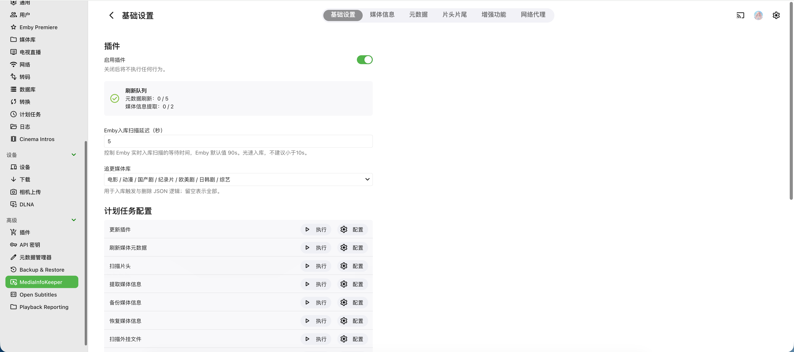

  

<h3 align="center">Emby Strm 插件，支持Strm直链，媒体信息持久化、元数据刷新</h3>

<b>Bangumi 角色中文名增强</b>

  
  

  

⏬ 安装
--------

1. 下载 dll 文件：[Releases](https://github.com/honue/MediaInfoKeeper/releases) 不带后缀的是通用版本，[最新通用版本](https://github.com/honue/MediaInfoKeeper/releases/latest/download/MediaInfoKeeper.dll)。
2. 放入 Emby 配置目录中的 `plugins` 目录。
3. 务必重命名为 `MediaInfoKeeper.dll`，否则后续自动更新会有两个 dll 存在。
4. 重启 Emby，在插件页面完成配置。

✨ 新增：Bangumi 角色中文名增强
--------

原版 MediaInfoKeeper 不含此功能，本分支在此基础上增加。

**功能**：从 Bangumi 获取角色中文名，写入 Emby 元数据。支持计划任务手动触发，配合媒体库范围筛选。

**搜索策略**（源语言优先）：
- 国漫 → 中文搜索，日漫 → 日文搜索，美漫 → 英文搜索
- 首次搜索无结果时统一降级为英文搜索

**国漫额外增强**：获取声优 Bangumi 别名与 TMDB 声优名交叉匹配，提升命中率。

**使用方法**：
1. 插件设置 → 元数据 → 开启「Bangumi 角色中文名增强」
2. 计划任务 → Bangumi 角色增强 → 配置媒体库范围 → 执行

🧩 兼容性
-----------

- 版本说明：本仓库最新代码始终以支持 Emby 最新 release 为目标，开发过程中可能出现阶段性兼容问题。

- 当前插件 `latest` 版本适配Emby `4.9.5.0`，全平台支持。

- 更新限制：插件自动更新任务已按 [版本区间](Version.json) 限制，不会更新到当前 Emby 不支持的插件版本。

- 不支持：`4.8` 系列

⚖️ Lisence
-----------

本项目基于 [GNU General Public License v3.0](LICENSE) 开源。

- 二次开发、改名发布或重新打包 DLL 时，必须在用户可见位置标注原作者与原项目来源。
- 发布派生版本或二进制文件时，必须遵守 GPLv3，保留许可证，并公开对应版本源码或提供有效源码获取方式。

⭐ Stars
------------

  

🙏 致谢
----

本项目在部分功能设计、补丁思路与资源集成上参考或使用了以下开源项目，感谢各位对 Emby 社区的长期贡献：

- [StrmAssistant](https://github.com/sjtuross/StrmAssistant)：部分功能 Patch 思路以及 `simple` 分词器文件来源。

- [dd-danmaku](https://github.com/l429609201/dd-danmaku)：弹幕资源 `ede.js` 来源。
